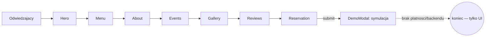

# ARCHITECTURE — mapa dla obcego (1 strona)

<!-- Cel: senior, ktory nigdy nie widzial repo, znajduje miejsce zmiany w 15 min. -->

## Co to jest (3 zdania)
Demo site "Eldhúsið" — **fikcyjna** rodzinna restauracja w centrum Reykjavíku, oparta na
islandzkich składnikach, świadomie pozycjonowana jako zwykła restauracja sąsiedzka a nie
aspiracyjne fine-dining. Zbudowana jako pokazowy przykład dla klientów agencji
[Reykjawwwik](https://reykjawwwik.is). Copy w całości po islandzku. Zero prawdziwych
klientów/rezerwacji/płatności.

## Stack (z package.json / README)
- Frontend: React + TypeScript, Vite, react-router-dom (1 realna trasa), TanStack Query (bez realnych zapytań)
- UI: Tailwind CSS + shadcn/ui (Radix), lucide-react
- Backend/DB: **brak** — demo nie ma nic do trwałego zapisu
- i18n: `src/i18n/LanguageContext.tsx` + `translations.ts` + `useLang.ts`
- Testy: Playwright E2E + Vitest (`src/test/`)
- Hosting: **Lovable** (`lovable-tagger` w `vite.config.ts`) — `git push` na `main` NIE deployuje,
  produkcję aktualizuje ręczny **Publish** w Lovable UI

## Moduły i granice (co jest gdzie)
| Katalog / plik | Odpowiedzialność | Tier |
|---|---|---|
| `src/pages/Index.tsx` | jedyna realna strona — składa sekcje one-page (Hero, Menu, About, Events, Gallery, Reviews, Reservation, Faq) | T1 |
| `src/components/Menu.tsx` | menu dań z cenami i zdjęciami (`src/assets/dish-*`) | T1 |
| `src/components/Reservation.tsx` | formularz rezerwacji stolika — kończy się modalem demo, bez realnej integracji | T1 |
| `src/components/DemoModal.tsx` + `src/components/useDemo.ts` | rdzeń mechaniki demo — podmienia realną akcję (rezerwacja, zamówienie) na komunikat informacyjny | T1 |
| `src/components/Hours.tsx` | godziny otwarcia i lokalizacja (above the fold wg README) | T1 |
| `src/components/TakeAway.tsx` / `Extras.tsx` / `GiftCards.tsx` | oferty dodatkowe (na wynos, ekstra dania, karty podarunkowe) — bez realnej płatności | T1 |
| `src/components/Events.tsx` | wydarzenia / rezerwacje grupowe | T1 |
| `src/i18n/*` | słownik i kontekst języka (domyślnie islandzki) | T1 |

## Przepływ użytkownika

## Gdzie jest…
- menu i ceny dań: `src/components/Menu.tsx`
- godziny/lokalizacja: `src/components/Hours.tsx`
- teksty (domyślnie IS): `src/i18n/translations.ts`
- symulacja rezerwacji: `src/components/useDemo.ts` + `src/components/DemoModal.tsx`
- sekrety: brak (zero integracji zewnętrznych)

## Decyzje nieodwracalne
`docs/adr/` — zobacz istniejące ADR w repo.

## Jak to cofnąć / kill switch
Strona statyczna bez backendu — rollback = Lovable "Revert to this version" albo `git revert` + Publish.
